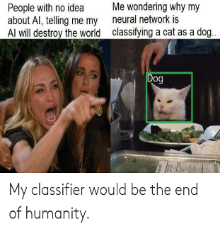
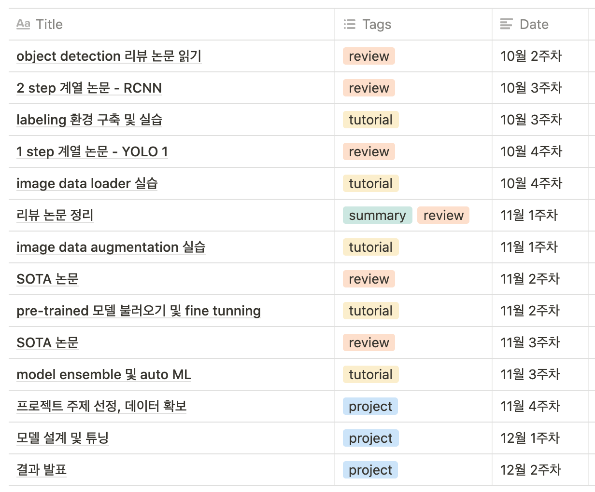
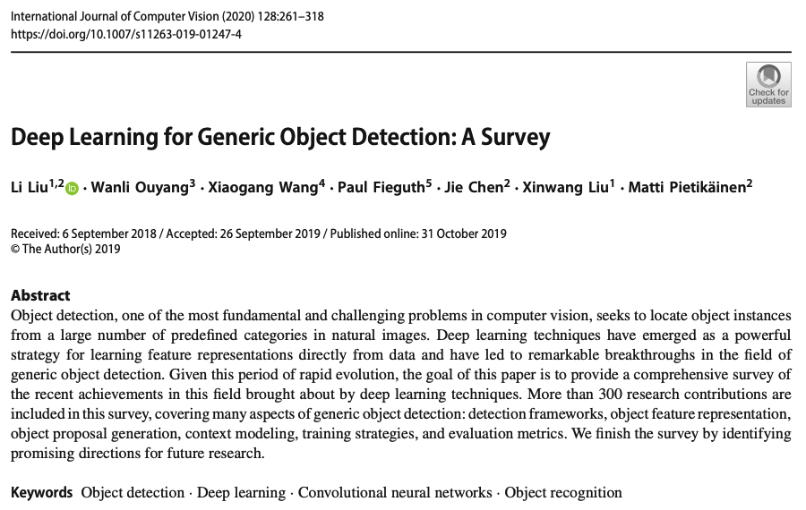
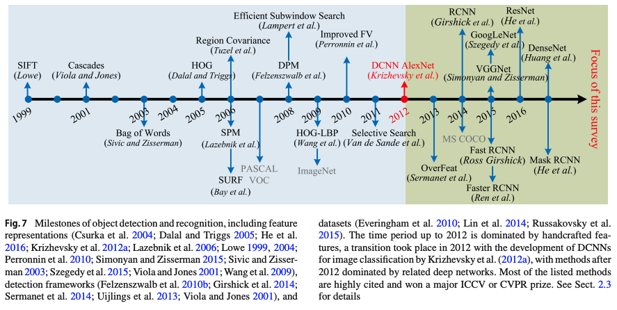
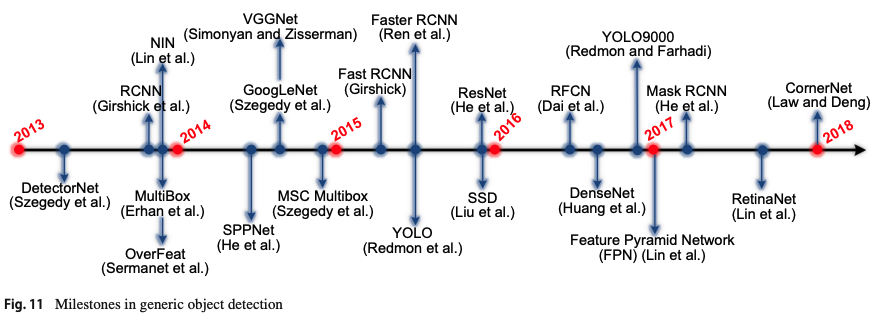

# Vision Lab - 가운데 눈
김창곤, 김태윤, 오민영, 이종현

---

# Table of Contents

&nbsp;&nbsp;&nbsp;&nbsp; 1. 연구랩 명칭
&nbsp;&nbsp;&nbsp;&nbsp; 2. 연구원 소개 및 역할 분담
&nbsp;&nbsp;&nbsp;&nbsp; 3. 연구 주제 및 목표
&nbsp;&nbsp;&nbsp;&nbsp; 4. 연구 결과물
&nbsp;&nbsp;&nbsp;&nbsp; 5. 연구 일정
&nbsp;&nbsp;&nbsp;&nbsp; 6. 진행 내용

---

# 1. 연구랩 명칭: 가운데 눈

- 3 개의 눈이 조화롭게 공부해나가자는 의미
- 확장성 없는 네이밍의 실패 사례

---

# 2. 연구원 소개: 올해 목표

- 김창곤
    - 딥러닝 프로젝트 발굴. 이미지 딥러닝 논문/연구 이해. 파이썬 코딩 꾸준히 
- 김태윤
    - 파이썬/텐서플로우/파이토치 자연스럽게 사용하기
- 오민영
    - 컴퓨터 비전에 관하여 여러 프로젝트 진행, 기타 로봇과 AI의 접목
- 이종현 (팀장)
    - 영상 분야, 자연어 처리 분야 딥러닝 프로젝트 2개 이상 진행

&nbsp;&nbsp;&nbsp;&nbsp;&nbsp;&nbsp;&nbsp;&nbsp;&nbsp;&nbsp;&nbsp;&nbsp;&nbsp;&nbsp;&nbsp;&nbsp;&nbsp;&nbsp;&nbsp;&nbsp;&nbsp;&nbsp;&nbsp;&nbsp;&nbsp;&nbsp;&nbsp;&nbsp;&nbsp;&nbsp;&nbsp;&nbsp;&nbsp;&nbsp;&nbsp;&nbsp;&nbsp;&nbsp;&nbsp;&nbsp;&nbsp;&nbsp;&nbsp;&nbsp;&nbsp;&nbsp;&nbsp;&nbsp;&nbsp;&nbsp;&nbsp;&nbsp;&nbsp;&nbsp;&nbsp;&nbsp;&nbsp;&nbsp;&nbsp;&nbsp;&nbsp;&nbsp;&nbsp;&nbsp;&nbsp;&nbsp;&nbsp;&nbsp;&nbsp;&nbsp;&nbsp;&nbsp;&nbsp;&nbsp;&nbsp;올해가 생각보다 얼마 남지 않았네요..?

---

# 3. 연구 주제 및 목표

---

# 3. 연구 주제 및 목표

- object detection 을 공부해보자!
    - 한번쯤 들어봤던 RCNN, YOLO 등등 아는 척 해보기
- 사전 학습된 모델을 불러와서 object detection 코드 템플릿을 만들어보자!
    - 적어도 고양이와 개는 잘 구분하자(?)
 

>       1주 1회 2시간 미팅 (매주 토요일 20 ~ 22시)
>       Notion을 이용한 일정 및 프로젝트 관리
[Go to our Notion Page!](https://www.notion.so/efb23a279173434cb8775b6539bcadb9)

---

# 4. 연구 결과물: 이것저것 조금씩

- 논문 공부한 흔적
    - 1 step (YOLO 계열) / 2 step (RCNN 계열) 고전 탐독
 
- Keras 실습 흔적
    - [edwith Keras Bootcamp](https://www.edwith.org/boostcourse-dl-tensorflow)
 
- 사전 학습 모델을 가져와서 데이터셋에 적용한 개인별 object detection 코드 템플릿

---

# 5. 연구 일정: 논문-실습 병행

---

# 6. 진행 내용: 리뷰 페이퍼 리딩 중

---

# 6. 진행 내용: 리뷰 페이퍼 리딩 중

---

# 6. 진행 내용: 리뷰 페이퍼 리딩 중

---

# Q&A
 
 
 
 

## &nbsp;&nbsp;&nbsp;&nbsp;&nbsp;&nbsp;&nbsp;&nbsp;&nbsp;&nbsp;&nbsp;&nbsp;&nbsp;&nbsp;&nbsp;&nbsp;&nbsp;&nbsp;&nbsp;&nbsp;&nbsp;&nbsp;&nbsp;&nbsp;&nbsp;&nbsp;&nbsp;&nbsp;&nbsp;&nbsp;&nbsp;&nbsp;&nbsp;&nbsp;&nbsp;&nbsp;&nbsp; Thank you! 