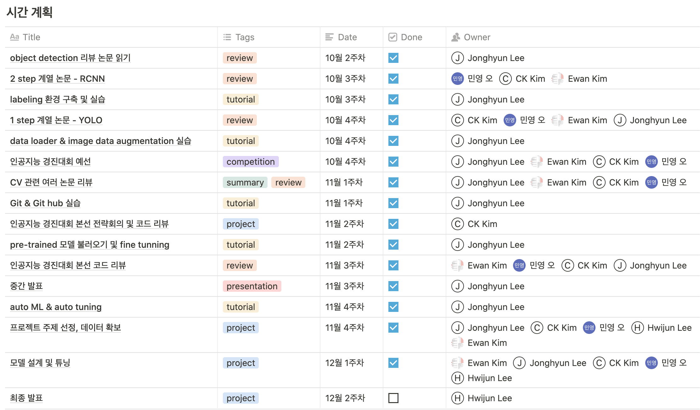
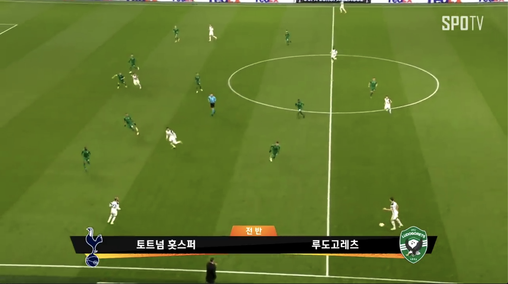
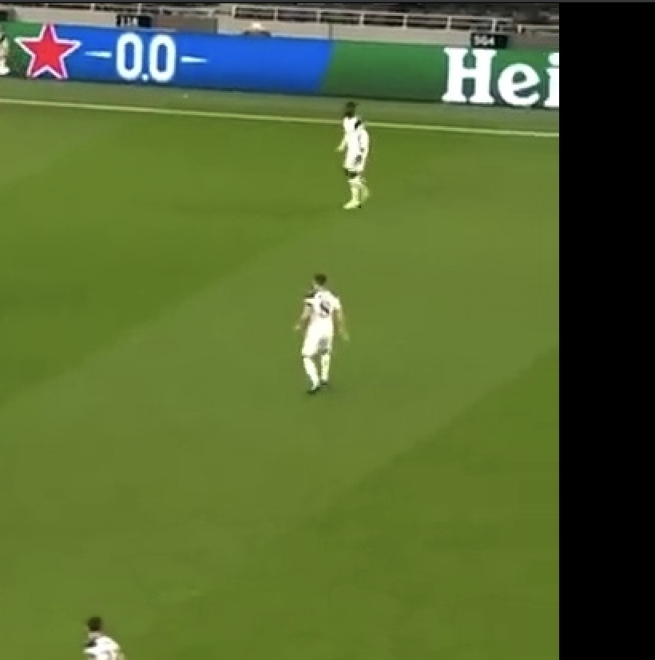
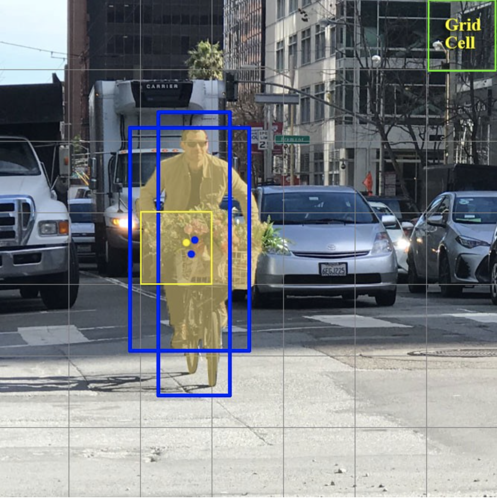
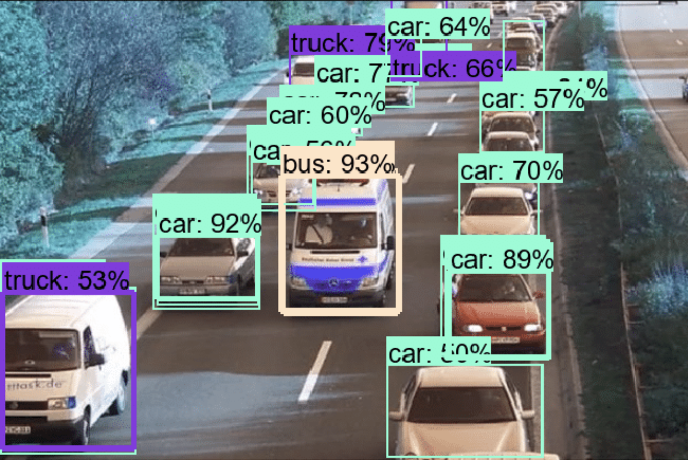
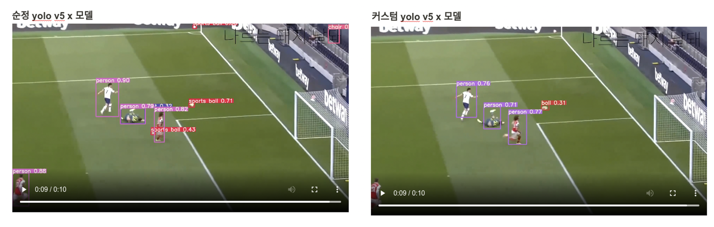
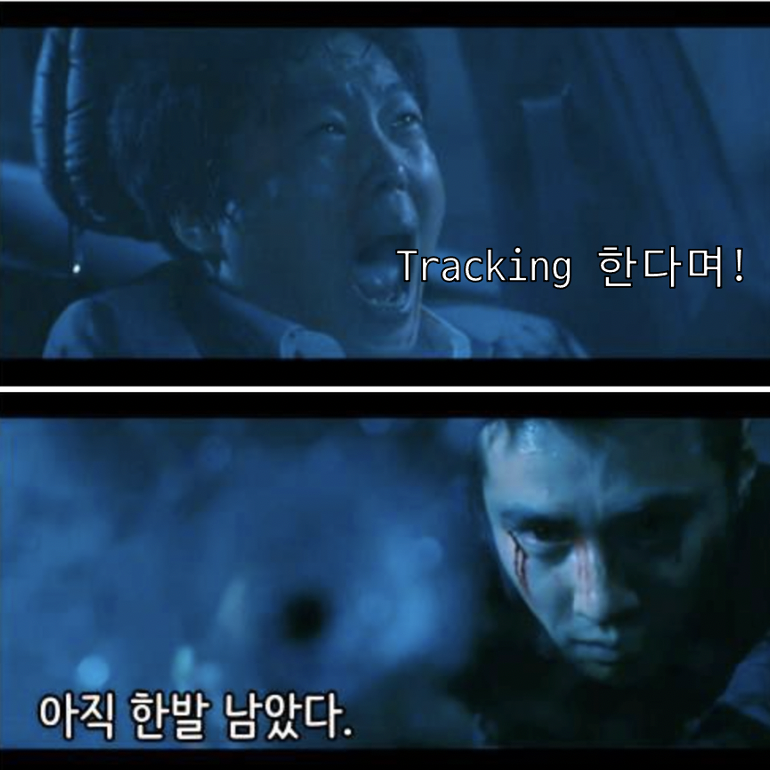

# Vision Lab - 가운데 눈
### 최종 발표

김창곤, 김태윤, 오민영, 이종현, 이휘준

---

# Table of Contents

1. 스터디 진행 사항
$~~~~~~~~~~~~$
2. 프로젝트
$~~~~~~~~~~~~$
3. 향후 일정
$~~~~~~~~~~~~$
4. 회고

---
# 1. 스터디 진행 사항

1. 모임 시간: 매주 토요일 20:30 ~ 24:00
$~~~~~~~~~~~~$
2. 핵심 가치: 논문 리딩, 적용 가능한 실습
$~~~~~~~~~~~~$
3. 프로젝트 : 논문과 실습을 아우르는 '우리만의' 프로젝트

---
# 1. 스터디 진행 사항

---
# 1. 스터디 진행 사항: 이론

1. object detection 경향 파악
    - DL 기반의 object detection 경향을 정리한 리뷰 페이퍼  
2. 2 stage 계열 object detection 
    - RCNN, fast RCNN, faster RCNN, mask RCNN
3. 1 stage 계열 object detection
    - YOLO v1, v2, v3, SSD, RetinaNet
4. various computer vision 리뷰
    - ResNet, Sort & DeepSort, Conv weigh visualization

---
# 1. 스터디 진행 사항: 실습

1. 개발 환경 세팅
    - docker
    - git & git hub
2. DL framework: Keras
    - data loader
    - image data augmentation
    - pre-trained model fine tuning
    - model ensemble and hard voting

---
# 1. 스터디 진행 사항:실습

3. image data annotation tool
    - CVAT
    
4. CNN based image classification, regression
    - 인공지능 경진대회 예선, 본선 대회 참가

---
# 1. 스터디 진행 사항: 실습

5. AutoML
    - pycaret 라이브러리
    - https://dacon.io/competitions/official/235647/codeshare/1701?page=1&dtype=recent&ptype=pub 

---
# 2. 프로젝트

축구 중계 영상에서 선수, 축구공 Object Detection (+ Tracking) 하기

---
# 2. 프로젝트: dataset

1. Fitogether 제공 데이터셋
    - 2019, 2020 시즌 K리그 경기장에서 획득한 고정 카메라 영상
    - 4K 25fps 영상, 4479 프레임 (약 3.5분)
    - Players, Ball, Others / 3개의 레이블

---
# 2. 프로젝트: dataset

---
# 2. 프로젝트: dataset

2. 스터디 생성 데이터셋
    - youtube 영상을 youtube-dl 프로그램을 이용하여 다운로드
        - 중계 영상 및 하이라이트 영상
    - 매 100 프레임마다 1개 프레임 추출
    - CVAT 툴을 이용하여 해당 영상 레이블링
    - Players, Ball / 2개의 레이블
    - 학습용: 100 프레임, 검증용: 100 프레임
---
# 2. 프로젝트: dataset

---
# 2. 프로젝트: preprocessing

영상 해상도가 제각각 -> bounding box를 중심으로 하는 작은 이미지로 crop & bounding box의 좌표 수정

---
# 2. 프로젝트: preprocessing

전처리 이후 데이터셋
1. Fitogether 제공 데이터 셋
    - 10554 장
2. 스터디 생성 데이터 셋
    - 951 장

---
# 2. 프로젝트: model

1. YOLO v3 (pytorch version)
    - https://github.com/ultralytics/yolov3

2. YOLO v4 (darknet)
    - https://github.com/AlexeyAB/darknet

3. YOLO v5 (pytorch version)
    - https://github.com/ultralytics/yolov5

추후 도전 과제
- 2 stage 계열 모델 (RCNN 계열)

---
# 2. 프로젝트: model

1. 이미지를 그리드로 분할
2. 각 그리드를 중심으로 하는 박스를 중심으로 탐색
3. 박스 안에 오브젝트가 있나? 있다면 어떤 오브젝트인가?

---
# 2. 프로젝트: model

--- 
# 2. 프로젝트: model

- 실시간 (1초당 20 frame 이상) 처리가 가능하고 준수한 정확도
- CCTV, 로봇, 자율 주행 등에 널리 쓰이고 있음

---
# 2. 프로젝트: fine tuning results
 

|$~~~~~~~~~$|$~~$epochs$~~$|$~~~~$mAP$~~~~$|players AP|$~~~$ball AP$~~~$|
|:------------|:------------:|:-----------:|:------------:|:-----------:|
| yolo v3      |      10      |    0.406    |     0.625    |    0.187    |
| yolo v4      |      10      |    0.538    |     0.896    |    0.181    |
| yolo v5: S   |      10      |    0.291    |     0.464    |    0.117    |
| yolo v5: M   |      10      |    0.345    |     0.565    |    0.124    |
| yolo v5: L   |      10      |    0.242    |     0.425    |    0.059    |
| yolo v5: X   |      10      |    0.657    |     0.603    |    0.711    |

---
# 2. 프로젝트: prediction sample

[Go to our notion](https://www.notion.so/8e626cd2f4c2414ca1de8f8c56ad2dac)

---
# 3. 향후 일정

---
# 3. 향후 일정

약 2주 간의 Tracking 모듈 구현을 위한 여정이 남아있습니다.
(우리 팀원들 모두 동의한 것 맞죠?)

Sort 및 Deep Sort 알고리즘
- https://github.com/theAIGuysCode/yolov3_deepsort
- https://github.com/LeonLok/Deep-SORT-YOLOv4

등을 참고하여 진행할 계획

---
# 4. 회고

1. 창곤
    - 새로운 분야에 도전하면서 좌충우돌 했었지만, 여러 분들과 함께 하면서 시야가 넓어졌습니다. 팀원을 비롯해 도움주신 모든분들께 감사드립니다.
2. 태윤
    - 이번 오픈랩 7기는 저에게 많은 선물을 주었습니다. 능력있고 친절한, 더 오랫동안 알고 싶은 랩원들, 새로 취업한 직장, 앞으로 공부해야할 분야를 결정 하는 등. 3개월간 서로 격려하고 응원해주며 따뜻한 마음을 나눌 수 있었던 가운데 눈 랩원들에게 감사합니다.

---
# 4. 회고

3. 민영
    - 여러 방면으로 인공지능이 활용됨을 알 수있는 좋은 기회였습니다! 대단하신 분들이 많아 자극을 받을 수 있는 기회였고, 스스로 최선을 다하지 못한 것 같아 아쉽습니다 ㅜㅜ 함께 해주신 분들께 감사드립니당
4. 종현
    - 부족한 랩장 믿고 따라와주셔서 정말 감사드립니다. 오랜만에 스터디하면서 정말 즐거웠습니다 : ) 혼자라면 절대 하지 못했을 분량이었는데 모두 함께 응원하고 수다떠는 그 시간이 너무 행복했습니다. 이 직업을 하는 것이 맞다는 확신 주셔서 정말 감사드리고 코로나 끝나면 꼭 정모해요!!!

--- 
# 4. 회고
5. 휘준
    - 중간부터 합류했지만 배려많은 팀원분들 덕에 많은 것을 배울 수 있었습니다. 무엇보다 시간도 많이 써주시고 멤버들을 걱정, 배려해주신 조장님께 감사드립니다. 몇 주 안됐지만 좋은 시간이었습니다!

---
# Q&A
 
 
 
 

## $~~~~~~~~~~~~~~~~~~~~~~~~~$ Thank you! 